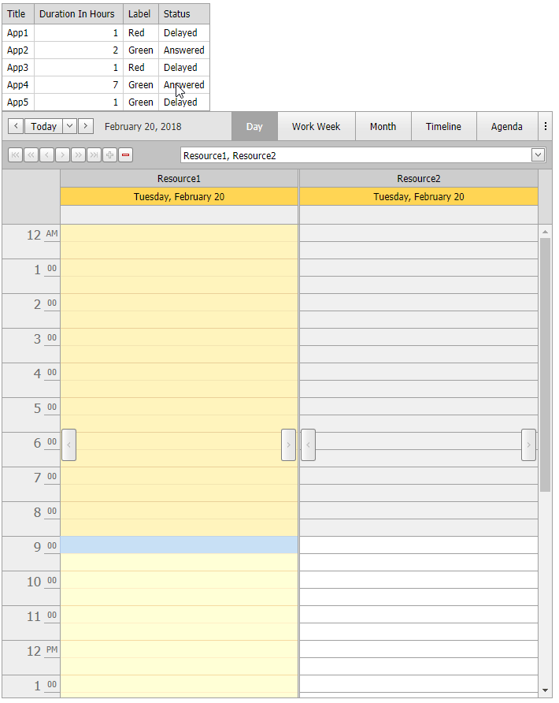

<!-- default badges list -->

<!-- default badges end -->

# Scheduler for ASP.NET Web Forms - How to drag-and-drop an appointment from an external control

This example demonstrates how to drag and drop an item from an external control ([ASPxGridView](https://docs.devexpress.com/AspNet/DevExpress.Web.ASPxGridView) in this example) to the [ASPxScheduler](https://docs.devexpress.com/AspNet/DevExpress.Web.ASPxScheduler.ASPxScheduler) area to create an appointment. An appointment is created in a time cell in which a corresponding grid item is dropped.

  
## Files to Review

* [SchedulerModel.cs](./CS/App_Code/SchedulerModel.cs) (VB: [SchedulerModel.vb](./VB/App_Code/SchedulerModel.vb))
* [Default.aspx](./CS/Default.aspx) (VB: [Default.aspx](./VB/Default.aspx))
* [Default.aspx.cs](./CS/Default.aspx.cs) (VB: [Default.aspx.vb](./VB/Default.aspx.vb))

## More Examples

* [How to drag a row from ASPxGridView to ASPxScheduler](https://github.com/DevExpress-Examples/how-to-drag-a-row-from-aspxgridview-to-aspxscheduler-e4292)
* [How to drop an appointment from ASPxScheduler to an external control](https://github.com/DevExpress-Examples/how-to-drop-an-appointment-from-aspxscheduler-to-an-external-control-e4708)
